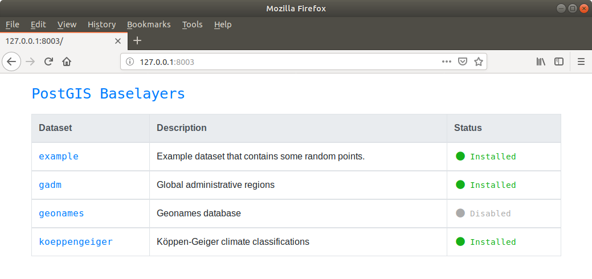

# PostGIS Baselayers

PostGIS Baselayers is a web application that connects to a PostGIS database and lets you automatically download and import a selection of popular open vector datasets (Natural Earth, GADM, Geonames, etc) into the database. It comes bundled with a Docker environment and a PostGIS container to get up and running quickly.

The application and database works nicely as a standalone spatial database that you can run queries against, or you can load data from it directly using QGIS/GDAL tools.

## Why

For a few years now I have had an assortment of different base layers lying around to help with making maps and visualizations, experimenting with PostGIS, and for various other spatial analysis tasks. Having these datasets just sitting around in all sorts of different formats was a hassle, and I decided to put some time into a framework that would organize them, make them available in a PostGIS environment, and that could be contributed to by others.

Installation of new datasets is a breeze with the installers, and having all the datasets in a single database lets you do all sort of fun queries across different datasets.

## Getting Started

### Quick Start

Clone the repository and build the containers with `docker-compose build` and start the service with `docker-compose up`. 

Once running, visit the management application in your browser at `http://localhost:8003/` and choose which datasets you want to install into the database. The container running the PostGIS database itself is exposed on port `35432` to avoid conflicts with other PostGIS instances that may be running on your machine.

### Existing Database

TODO

## Datasets

Vector datasets currently available in PostGIS Baselayers are currently:

* [Geonames](app/datasets/geonames/)
* [GADM](app/datasets/gadm/)
* [Koeppen-Geiger Climate Classifications](app/datasets/koeppengeiger/)
* [Example](app/datasets/example/)

If there is a dataset you'd like to see included, please create an issue in the issue tracker, or have a look at [CONTRIBUTING.md](CONTRIBUTING.md) on how to add it yourself.

## Contributing

See [CONTRIBUTING.md](CONTRIBUTING.md) for more information.

## Issues

See the issue tracker for a list of issues and features.