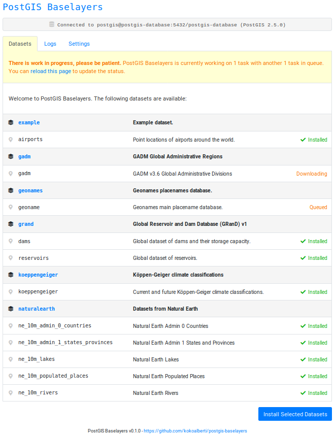

# PostGIS Baselayers 0.1.0

PostGIS Baselayers is a web application that connects to a PostGIS database and lets you automatically download and import a selection of popular open vector datasets (Natural Earth, GADM, Geonames, etc) into the database. It comes bundled with a Docker environment and a PostGIS database container to get up and running quickly.

  

The application and database works nicely as a standalone spatial database that you can run queries against, or you can load data from it directly using QGIS/GDAL tools.

See blog post for more info: [Introducing PostGIS Baselayers: Automatically import Natural Earth, Geonames, GADM, and other popular vector datasets into a PostGIS database](https://kokoalberti.com/articles/postgis-baselayers-importing-popular-vector-datasets-into-postgis/).

## Why

For a few years now I have had an assortment of different base layers lying around to help with making maps and visualizations, experimenting with PostGIS or QGIS, and for various other spatial analysis tasks. Having these datasets just sitting around in all sorts of different formats was a hassle, and I decided to put some time into a framework that would organize them and let you get up and running quickly with a large collection of open vector datasets.

Installation of new datasets is a breeze with the installers and saves a lot of time compared to figuring out yourself how to download import these datasets into your database. Just click install, and get started with some analysis or visualization task 

Also, having all the datasets in a single database lets you do all sort of fun queries across different datasets, for example making a list of reservoirs in the state of California, or finding out the climate classification of the 20 largest cities in the world.

## Quick Start

### Using Docker and a PostGIS container

Clone the repository: 

    git clone https://github.com/kokoalberti/postgis-baselayers.git

Then build the containers: 

    docker-compose build

And start the service with:

    docker-compose up

Once running, visit the management application in your browser at `http://localhost:8003/` and choose which datasets you want to install into the database. Some of them are quite large (in excess of 1Gb) so make sure that you have plenty of bandwidth/storage space available.

See [`docker-compose.yaml`](docker-compose.yaml) for more information.

### Using Docker and an existing PostGIS database

It is also possible to point PostGIS Baselayers at an existing database using the `docker-compose-standalone.yaml` file. First clone the repository:

    git clone https://github.com/kokoalberti/postgis-baselayers.git

Configure the database connection in the `.env` file:

    POSTGRES_HOST=localhost
    POSTGRES_PORT=5432
    POSTGRES_DB=testdb
    POSTGRES_USER=postgres
    POSTGRES_PASSWORD=postgres

In this case `localhost` will refer to the Docker host, as the container in `docker-compose-standalone.yaml` is started with `network_mode=host`. Then build the container:

    docker-compose -f docker-compose-standalone.yaml build

Start it:

    docker-compose -f docker-compose-standalone.yaml up

And you can access the application as usual at `http://localhost:8003/`. See [`docker-compose-standalone.yaml`](docker-compose-standalone.yaml) for more information.

### Other Options

It is also possible to run the application directly as a Flask/WSGI app on another machine without the use of Docker, but that is not documented at this time. See the application's [`Dockerfile`](app/Dockerfile) for some hints on getting up and running on Ubuntu.

Another option is to use the dataset Makefiles directly without the web application. You'll have to set the same environment variables as defined in `.env` as well as the composited convenience variables `POSTGRES_URI` and `POSTGRES_OGR`. Then run a command like `make -f <layer>.make install` to install the relevant layer into the database. See the [`datasets`](app/datasets/) directory containing Makefiles for all datasets for more information.

Accessing databases using SSL (for example on AWS RDS) is supported through the `POSTGRES_SSLMODE=verify-full` and `POSTGRES_SSLROOTCERT=/root/.postgresql/root.crt` parameters. The `/root/.postgresql/root.crt` for Amazon RDS has been `ADD`ed into the application container on build. To use another one change the path or overwrite it.

## Accessing Data

Once a dataset is installed, you can access the PostGIS database using your favorite access method. When using the PostGIS container bundled with the application, the default credentials are as follows:

    Hostname: localhost
    Port: 35432
    Database name: postgis-database
    Username/password: postgis

See for some more examples:

* [QGIS](docs/QGIS.md)
* [GDAL/OGR](docs/GDALOGR.md)
* [PSQL](docs/PSQL.md)

## Datasets

Vector datasets currently available in PostGIS Baselayers are a selection of:

* [Geonames](app/datasets/geonames/)
* [GADM](app/datasets/gadm/)
* [Koeppen-Geiger Climate Classifications](app/datasets/koeppengeiger/)
* [Natural Earth](app/datasets/naturalearth/)
* [GRanD Global Reservoirs and Dams](app/datasets/grand/)

And an example dataset that can help you get started if you're interested in adding other datasets:

* [Example](app/datasets/example/)

If there is a dataset you'd like to see included, please create an issue in the issue tracker, or have a look at [CONTRIBUTING.md](CONTRIBUTING.md) on how to add it yourself.

## Contributing

See [CONTRIBUTING.md](CONTRIBUTING.md) for more information.

## Issues

See the issue tracker for a list of issues and feature/data requests.