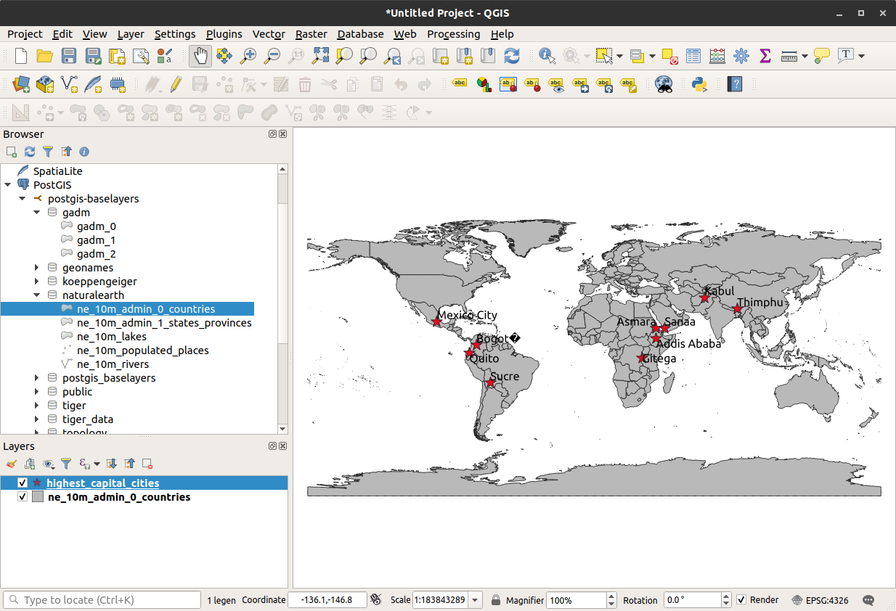

# Accessing data with GDAL/OGR

See also the GDAL/OGR [PostgreSQL/PostGIS driver](https://www.gdal.org/drv_pg.html) page for more information.

With GDAL/OGR the following connection string can be used: 

    PG:"dbname=postgis-database host=localhost port=35432 user=postgis password=postgis"

Then for example run a query and save the results to a Shapefile:

    $ ogr2ogr -f "ESRI Shapefile" \
        highest_capital_cities.shp \
        PG:"dbname=postgis-database host=localhost port=35432 user=postgis password=postgis" \
        -sql "SELECT the_geom, name, gtopo30 AS elevation FROM geonames.geoname WHERE fcode = 'PPLC' ORDER BY elevation DESC LIMIT 10"

Which can then be loaded in QGIS:

